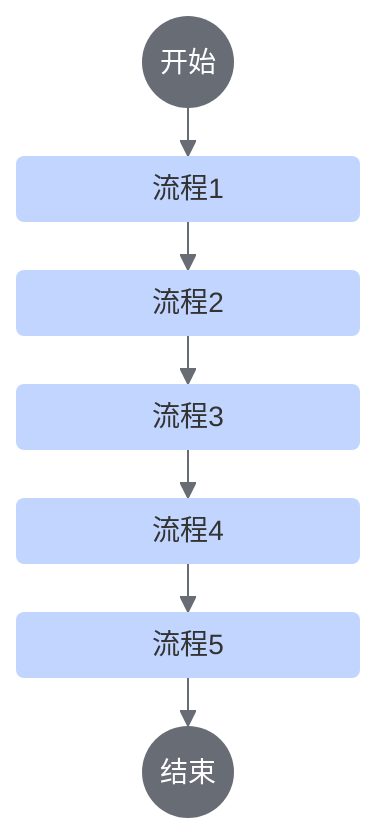
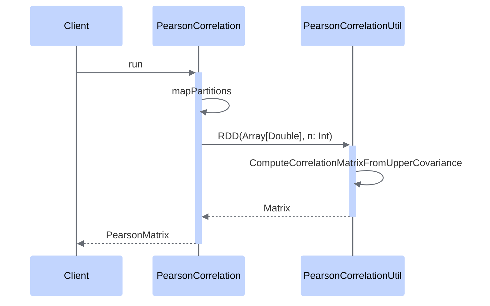
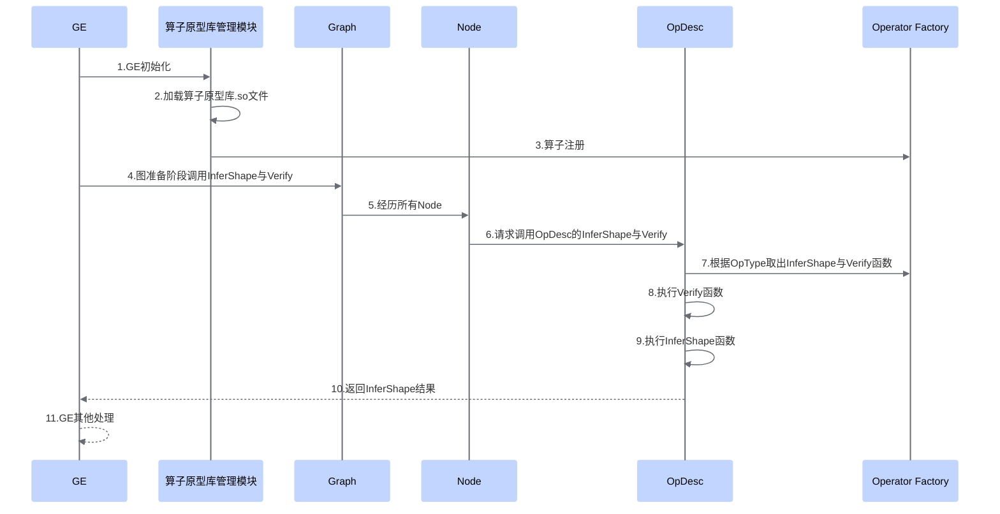

# 流程图 Mermaid 代码

## 流程图（遵从图形规范）

```mermaid
%%{init: {
  "themeVariables": {
    "lineColor": "#686D75",
    "edgeStrokeWidth": "1px",
    "fontSize": "14px",
    "fontFamily": "HarmonyOS Sans, sans-serif"
  },
  "flowchart": { "padding": 6, "htmlLabels": true, "useMaxWidth": false, "rankSpacing": 24, "nodeSpacing": 24 }
}}%%
flowchart TD
    Start(("<div style='width:40px;height:40px;border-radius:50%;display:flex;align-items:center;justify-content:center;color:#ffffff'>开始</div>")):::circle
    A["<div style='width:148px;display:flex;align-items:center;justify-content:center'>流程1</div>"]:::blue
    B["<div style='width:148px;display:flex;align-items:center;justify-content:center'>流程2</div>"]:::blue
    C["<div style='width:148px;display:flex;align-items:center;justify-content:center'>流程3</div>"]:::blue
    D["<div style='width:148px;display:flex;align-items:center;justify-content:center'>流程4</div>"]:::blue
    E["<div style='width:148px;display:flex;align-items:center;justify-content:center'>流程5</div>"]:::blue
    End(("<div style='width:40px;height:40px;border-radius:50%;display:flex;align-items:center;justify-content:center;color:#ffffff'>结束</div>")):::circle

    classDef blue   fill:#C2D5FE,stroke-width:0,rx:4px,ry:4px;
    classDef circle fill:#686D75,stroke-width:0,color:#ffffff;

    Start --> A --> B --> C --> D --> E --> End

```

## 时序图-带激活条（遵从图形规范）

```mermaid
%%{init: {
  "themeVariables": {
    "actorBkg": "#C2D5FE",
    "actorBorder": "#C2D5FE",
    "actorLineColor": "#686D75",
    "activationBkgColor": "#C2D5FE",
    "activationBorderColor": "#C2D5FE",
    "signalColor": "#686D75",
    "fontFamily": "HarmonyOS Sans, sans-serif",
    "fontSize": "14px"
  }
}}%%
sequenceDiagram
    participant C as Client
    participant P as PearsonCorrelation
    participant U as PearsonCorrelationUtil
    C->>+P: run
    P->>P: mapPartitions
    P->>+U: RDD(Array[Double], n: Int)
    U->>U: ComputeCorrelationMatrixFromUpperCovariance
    U-->>-P: Matrix
    P-->>-C: PearsonMatrix
```

## 时序图-不带激活条（遵从图形规范）

```mermaid
%%{init: {
  "themeVariables": {
    "actorBkg": "#C2D5FE",
    "actorBorder": "#C2D5FE",
    "actorLineColor": "#686D75",
    "signalColor": "#686D75",
    "fontFamily": "HarmonyOS Sans, sans-serif",
    "fontSize": "14px"
  }
}}%%
sequenceDiagram
    participant GE as GE 
    participant M as 算子原型库管理模块
    participant G as Graph
    participant N as Node
    participant O as OpDesc
    participant F as Operator Factory

    GE->>M: 1.GE初始化
    M->>M: 2.加载算子原型库.so文件
    M->>F: 3.算子注册
    GE->>G: 4.图准备阶段调用InferShape与Verify
    G->>N: 5.经历所有Node
    N->>O: 6.请求调用OpDesc的InferShape与Verify
    O->>F: 7.根据OpType取出InferShape与Verify函数
    O->>O: 8.执行Verify函数
    O->>O: 9.执行InferShape函数
    O-->>GE: 10.返回InferShape结果
    GE-->>GE: 11.GE其他处理
```

